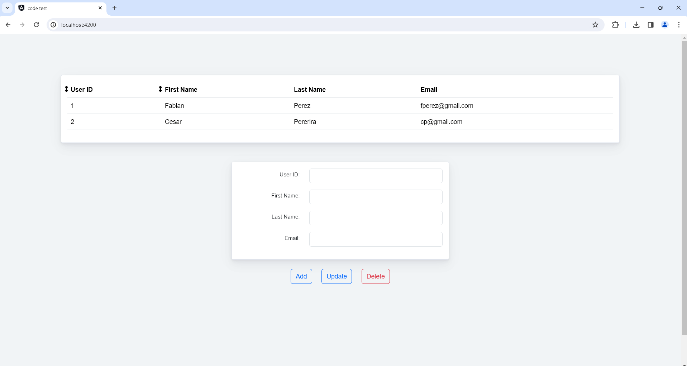

# code-test
Code test 18/02/2024

### Node

* Node 18.3.0
* npm 8.19.3
  
### Dependencies

* Angular 
* NgRx
* Bootstrap

### Start server

The demo uses json-server to mock the server.
Run the next command in terminal 1:

* Start server:  `npm run json:server`

Keep this script running.

### Start the app

Run the next command in terminal 2:

* Start app:  `npm run start`

The app will be available at: http://localhost:4200/

.
